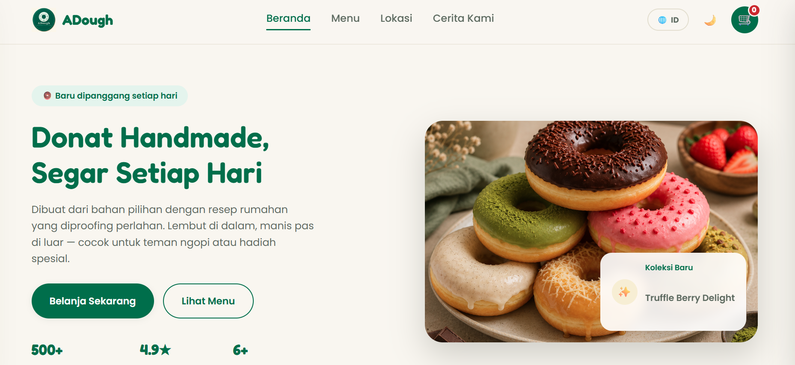
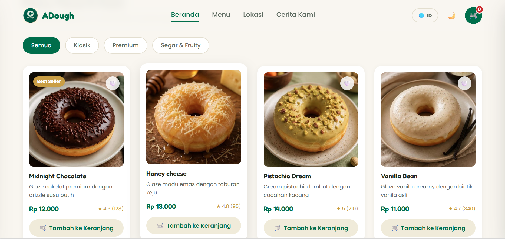
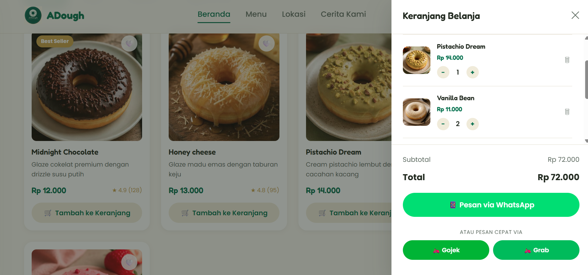
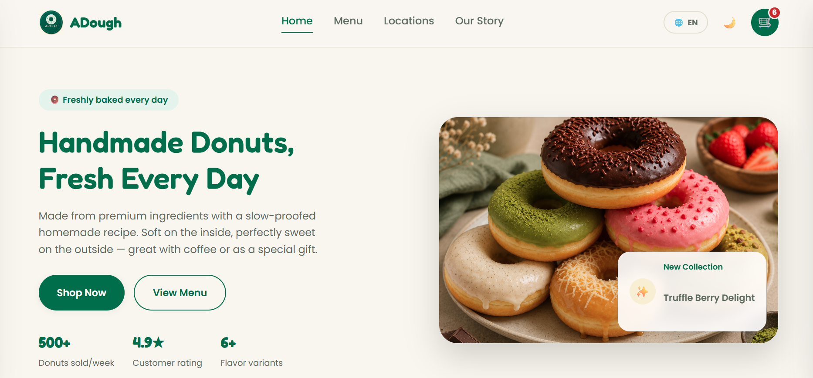
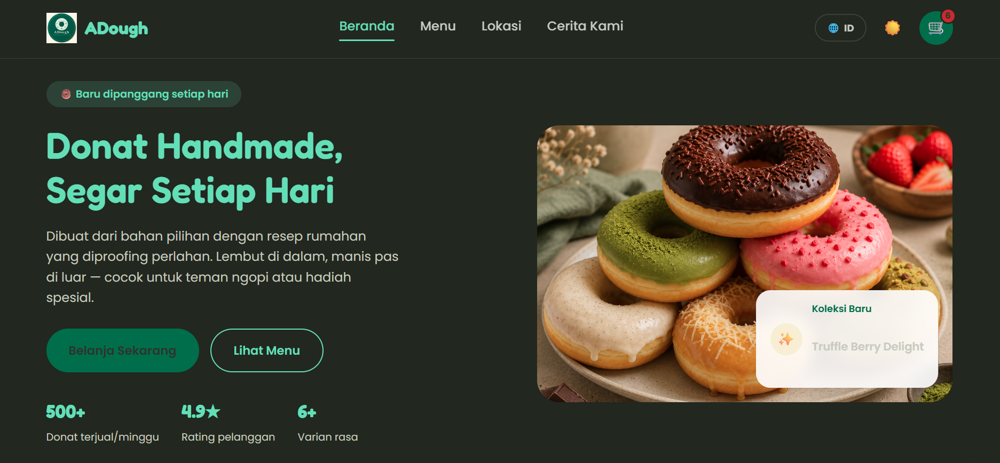
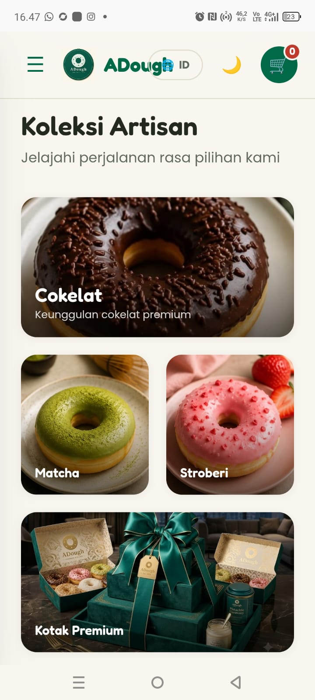

# 🍩 ADough — Artisan Donut E-Commerce

Tugas Proyek Ujian Akhir Semester (UAS) — Mata Kuliah KAIT II (E-Commerce/HTML)

**Disusun oleh:** Aullia Dewi (209250121)

**Program Studi:** Administrasi Bisnis

**Dosen Pengampu:** Yoki Oktarian Sukardi S.Kom., M.A.B

---

## 📄 Deskripsi Proyek

**ADough** adalah sebuah website *e-commerce Business-to-Consumer* (B2C) yang dirancang untuk usaha donat rumahan artisan. Website ini dibangun sebagai etalase digital yang memungkinkan pelanggan menjelajahi katalog produk, memilih varian rasa donat, mengelola keranjang belanja, hingga melakukan pemesanan langsung melalui WhatsApp — tanpa memerlukan sistem pembayaran daring yang kompleks, sesuai dengan skala operasional usaha kecil.

Website ini dibangun murni menggunakan **HTML5, CSS3, dan JavaScript** tanpa framework maupun library eksternal, dengan fitur tambahan berupa dukungan **dwibahasa (Indonesia/Inggris)** dan **mode gelap (dark mode)**.

🔗 **Live Website (GitHub Pages):** [https://auliadewii313-commits.github.io/adough-website/](#)

---

## 🖼️ Screenshot Tampilan (UI/UX)

Berikut adalah antarmuka website yang responsif di berbagai perangkat (Desktop & Mobile):

### 1. Halaman Beranda (Hero Section)


### 2. Koleksi Kategori & Katalog Produk


### 3. Keranjang Belanja & Checkout via WhatsApp


### 4. Mode Dwibahasa (Indonesia/English)


### 5. Mode Gelap (Dark Mode)


### 6. Tampilan Mobile (Responsive)


---

## ✨ Fitur Utama

- 🛒 **Keranjang Belanja Interaktif** — tambah, ubah jumlah, dan hapus produk secara *real-time*
- 🔍 **Filter Kategori Produk** — Klasik, Premium, Segar & Fruity
- 💬 **Checkout via WhatsApp** — rincian pesanan otomatis terkirim ke nomor toko
- 🌗 **Mode Gelap (Dark Mode)** — nyaman digunakan siang maupun malam
- 🌐 **Dwibahasa (i18n)** — beralih Indonesia ⇄ Inggris tanpa reload halaman
- 📱 **Responsive Design** — menyesuaikan tampilan Desktop, Tablet, dan Mobile
- 📧 **Formulir Newsletter** — validasi input sederhana

---

## 🗂️ Struktur Proyek VS Code

```
TUGAS BESAR IT
├── index.html          → Struktur & konten utama halaman
├── style.css           → Seluruh styling (CSS Grid & Flexbox)      
├── js/
│   ├── produk.js         → Data/database produk donat
│   ├── i18n.js            → Kamus terjemahan Indonesia/Inggris
│   └── script.js           → Logika interaktif (keranjang, filter, tema)
├── images/               → Aset gambar & ilustrasi produk
```

---

## 🛠️ Teknologi yang Digunakan

| Teknologi | Kegunaan |
|---|---|
| HTML5 | Struktur & semantik halaman |
| CSS3 (Grid & Flexbox) | Styling dan tata letak responsif |
| JavaScript (Vanilla) | Interaktivitas & logika fungsional |
| Google Fonts | Tipografi (Poppins & Fredoka) |
| GitHub Pages | Hosting website secara gratis |

---

## 📊 Dokumentasi Bisnis & Strategi E-Commerce

Website ini dirancang tidak hanya dari sisi teknis, tetapi juga mempertimbangkan strategi bisnis usaha kecil:

- **Product Assortment** — pengelompokan produk berdasarkan kategori memudahkan pelanggan dalam pengambilan keputusan pembelian
- **Promotion** — highlight produk *best seller* dan promo "Beli 6 Gratis 1" sebagai strategi retensi pelanggan
- **Business-Technology Alignment** — pemilihan checkout via WhatsApp (bukan payment gateway) disesuaikan dengan skala dan kapasitas operasional usaha rumahan
- **Market Expansion** — fitur dwibahasa membuka peluang menjangkau segmen pelanggan yang lebih luas

---

## 📌 Catatan

Proyek ini dibuat untuk memenuhi tugas akhir mata kuliah KAIT-II, adapuna data produk masih bersifat statis dan gambar produk menggunakan ilustrasi sementara (*placeholder*) yang dapat digantikan dengan foto produk asli pada pengembangan selanjutnya.
